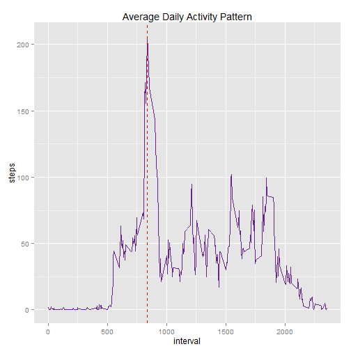
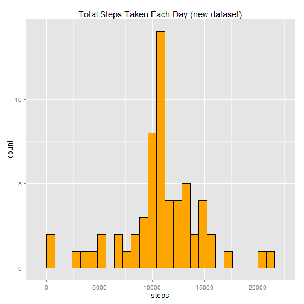

Reproducible Research: Peer Assessment 1
========================================================

The data for this assignment can be downloaded from [Activity monitoring data]("https://d396qusza40orc.cloudfront.net/repdata%2Fdata%2Factivity.zip") or from my GitHub reposetory.

## Loading and preprocessing the data

First the input file is extracted from the zip file and loaded in to memory as a data-frame. Also, the date field is converted to date format. 

```r
fname <- "activity.zip"
fname <- unz(fname,"activity.csv")
dat <- read.csv(fname, header=TRUE)
dat$date <- as.Date(dat$date, format = "%Y-%m-%d")
```

## What is mean total number of steps taken per day?

#### 1. Make a histogram of the total number of steps taken each day
Calculating the total number of steps by day. Please note the missing values in the dataset has been excluded in all the calculations.  
In the histogram below, the red and green dashed lines show mean and median of the number of steps respectively. 

```r
library(ggplot2)
sumdat<- aggregate(dat$steps, by = list(dat$date), sum, na.rm=TRUE)
colnames(sumdat) <- c("date","steps")
ggplot(sumdat, aes(x=steps)) + geom_histogram(colour="black", fill="orange", binwidth =800) +
        geom_vline(aes(xintercept=mean(steps, na.rm=T)),
                   color="red", linetype="dashed", size=1,show_guide = TRUE) +
        geom_vline(aes(xintercept=median(steps, na.rm=T)),
                   color="green4", linetype="dashed", size=1, show_guide = TRUE) +
        ggtitle("Total Steps Taken Each Day")
```

 
#### 2. The mean and median total number of steps taken per day 
The mean for the total steps per day is calculated as follows:


```r
mean(sumdat$steps)
```

```
## [1] 9354
```
The median for the total steps per day is calculated as follows:


```r
median(sumdat$steps)
```

```
## [1] 10395
```
For visual presentation of mean and median please refer to the above graph.  
## What is the average daily activity pattern?

The graph below illustrates the average daily activity pattern against the value of interval.

```r
sumdat <- aggregate(dat$steps, by = list(dat$interval), mean, na.rm=TRUE)
colnames(sumdat) <- c("interval","steps")
mx <- sumdat[which.max(sumdat$steps),1]
ggplot(sumdat, aes(x=interval, y=steps),xlab="Interval", ylab="Total number of steps") + 
        geom_line(size=0.7, color="darkorchid4") +
        geom_vline(xintercept=mx,
                   color="red", linetype="dashed", size=.5,show_guide = TRUE) +
        ggtitle("Average Daily Activity Pattern")
```

 
#### 2. Which 5-minute interval, on average across all the days in the dataset, contains the maximum number of steps


```r
sumdat[which.max(sumdat$steps),1]
```

```
## [1] 835
```

## Imputing missing values

#### 1. Calculate and report the total number of missing values in the dataset

```r
sum(is.na(dat$steps))
```

```
## [1] 2304
```
#### 2. Devise a strategy for filling in all of the missing values in the dataset.
First all the missing values are saved in a new data-table. After moving the missing values, all the rows with missing values are deleted and place in a new data-table (newdat).In the next step, the mean result dataset (sumdat) calculated in the previous section is merged with missing data-table. After cleaning this dataset such as replacing the old steps column with the mean column. 


```r
misVals <- dat[is.na(dat$steps),c(2,3)]
newdat <- na.omit(dat)
colnames(sumdat) <- c("interval","steps")
misVals <- merge(x=misVals, y=sumdat, by="interval", all.x=TRUE)
misVals$steps <- round(misVals$steps)
```
#### 3. Create a new dataset that is equal to the original dataset but with the missing data filled in.
At the end the two data sets, newdat and misval are merged using rbind function to form a new data set.

```r
newdat <- rbind (newdat, misVals)
```
#### 4. Make a histogram of the total number of steps taken each day

```r
sumdat <- aggregate(newdat$steps, by = list(newdat$date), sum, na.rm=TRUE)
colnames(sumdat) <- c("date","steps")
ggplot(sumdat, aes(x=steps)) + geom_histogram(colour="black", fill="orange", binwidth =800) +
        geom_vline(aes(xintercept=mean(steps, na.rm=T)),
                   color="red", linetype="dashed", size=.3,show_guide = TRUE) +
        geom_vline(aes(xintercept=median(steps, na.rm=T)),
                   color="green4", linetype="dashed", size=.3, show_guide = TRUE) +
        ggtitle("Total Steps Taken Each Day (new dataset)")
```

 

The mean total number of steps taken per day:

```r
mean(sumdat$steps)
```

```
## [1] 10766
```

The median total number of steps taken per day:

```r
median(sumdat$steps)
```

```
## [1] 10762
```
The mean and median values for the new dataset (exc;uding missing values) are different from the first section where the dataset includes missing values. However the difference between medians of the old and the new dataset is very small. The impact of imputing missing data is more visible in the gap between mean and median of the new data. In the new dataset median and mean are almost the same. This can be seen by comparing the first and second histogram. In the last histogram the red and green dashed lines are overlapped.
## Are there differences in activity patterns between weekdays and weekends?

#### 1. Create a new factor variable in the dataset with two levels - "weekday" and "weekend" indicating whether a given date is a weekday or weekend day.  
Using weekdays function created a new field(column) for week day names. Then group the two categories weekday and weekend and then factored by this column.


```r
newdat$daytype <- weekdays(newdat$date)
newdat$daytype[newdat$daytype=="Saturday" | newdat$daytype=="Sunday"] <- "weekend"
newdat$daytype[newdat$daytype !="weekend"] <- "weekday"
newdat$daytype <- as.factor(newdat$daytype)
```
#### 2. Make a panel plot containing a time series plot  
In order to make this plot, first the number of the steps had to aggregated and group by type of the week day (weekend or weekdays) and then by value of interval. Lattic library is used for this plot to imitate the example in the assignment's instruction.

```r
sumdat <- aggregate(newdat$steps, by = list(newdat$daytype, newdat$interval), mean, na.rm=TRUE)
colnames(sumdat) <- c("daytype", "interval", "mean")
library(lattice)
xyplot(sumdat$mean ~ sumdat$interval | sumdat$daytype, layout = c(1, 2), type = "l", lwd=2 , xlab= "Interval", ylab = "Number of steps")
```

 
